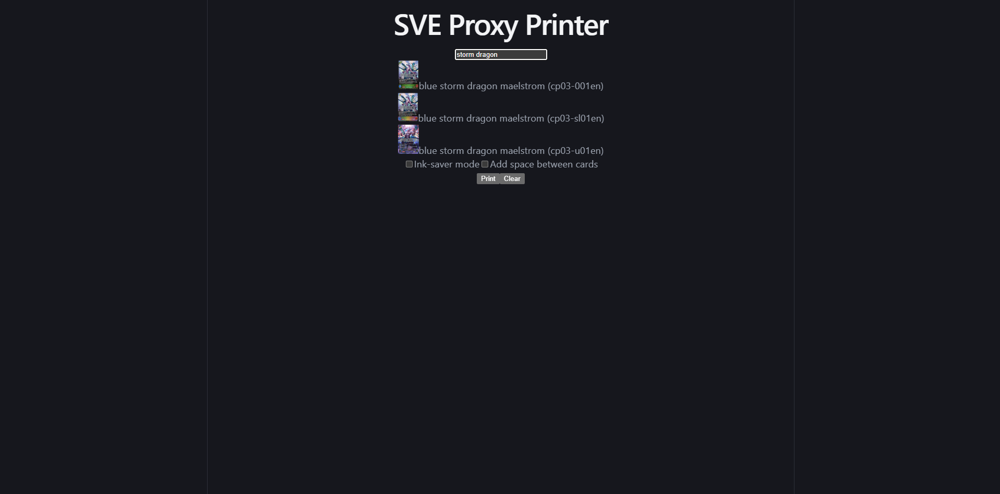

# Shadowverse Evolve Proxy Printer
**Work in Progress** — actively being developed. Not yet deployed.

A web app for printing proxy cards to test decks for the Shadowverse Evolve TCG.

## Tech Stack
**Frontend:** React (Vite), Axios  
**Backend:** FastAPI (Python)  
**Database:** PostgreSQL (Supabase)  
**Infrastructure:** AWS S3

## Current Features
- Search 5000+ cards by name
- Add multiple copies of cards to your deck list

## In Progress
- Remove cards by clicking them
- Ink-saver mode (grayscale)
- Optional spacing between cards
- Print-ready 3-card grid layout
- Need to add Gloryfinder cards and certain leaders that did not make it through

## How It Works
1. Card images are scraped and watermarked with a Python script
2. Images are stored in AWS S3
3. Card metadata is stored in PostgreSQL on Supabase
4. FastAPI serves a REST API with a debounced card search endpoint
5. React frontend lets users build a card list and print it

## Home Page
Landing page where users can browse the application and begin searching for cards

## Card Search
Search for cards by name

## Card Preview
View a high resolution preview of the selected card 

## Running Locally
This project requires access to a private AWS S3 bucket and Supabase database.
If you'd like a live demo or have questions about the project, feel free to reach out!

## Contact
- **Email:** shaikmupasha@gmail.com
- **LinkedIn:** https://www.linkedin.com/in/shaik-pasha-198975273/

## Disclaimer
Card images are copyright Cygames. This project is not affiliated
with or endorsed by Cygames. For personal and casual play use only.
